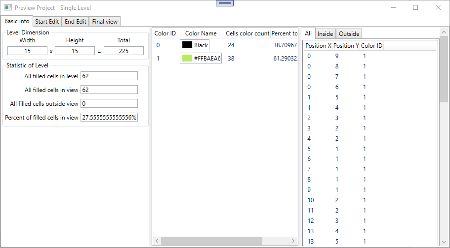
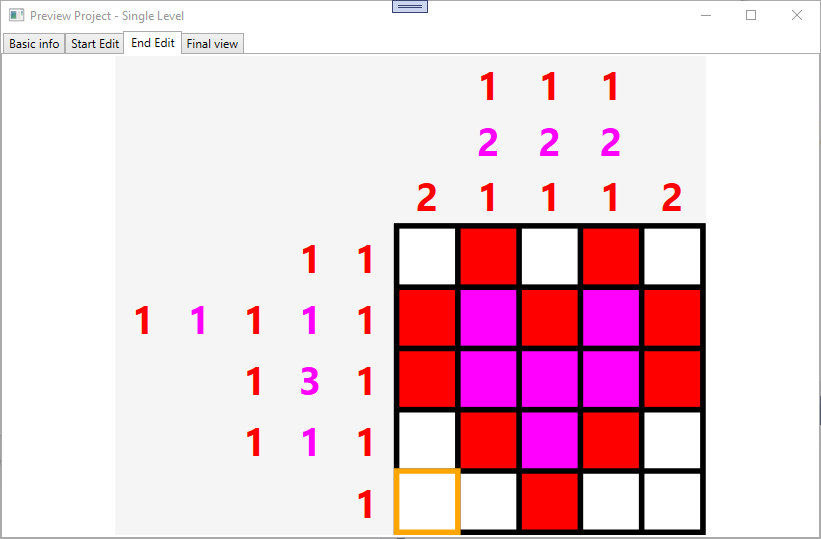
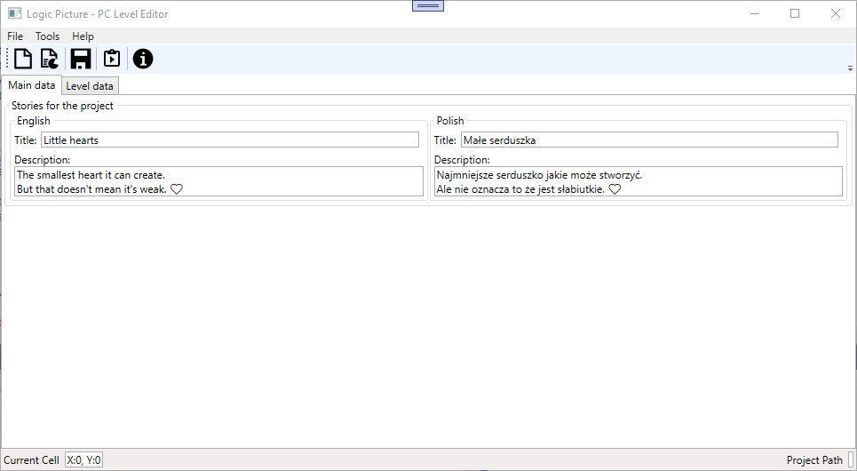

# Logic Picture - PC Level Editor
User-friendly tool for preparing levels for the Unity game: Logic Picture. The source code of this game you can find here: https://github.com/bertekg/LogicPicture_UnitySRC.

## Screenshots

### 1. Level 'Smile Face 15x15' on 'Level data' tab and 'About Program' window

### 2. 'Preview Project' window on 'Basic info' tab for level 'Smile Face 15x15'

### 3. 'Preview Project' window on 'End Edit' tab for level 'Little Heart 5x5'

### 4. Level 'Little Heart 5x5' on 'Main data' tab

